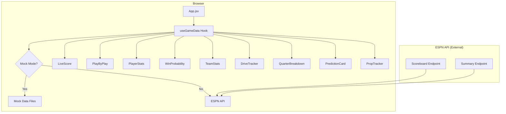
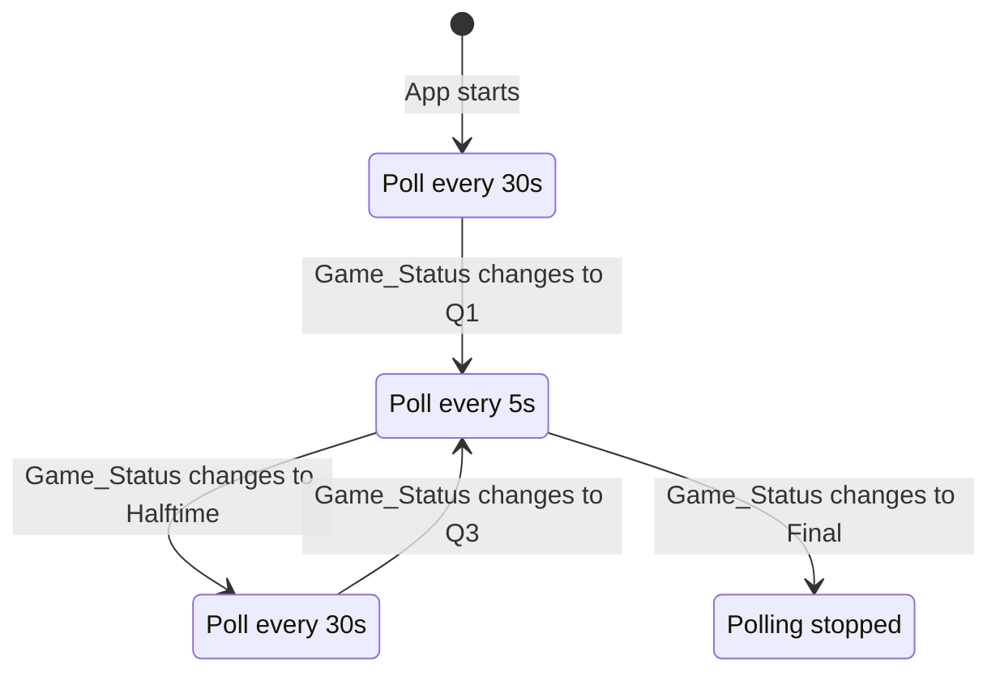

# Design Document: Super Bowl LX Live Dashboard

## Overview

The Super Bowl LX Live Dashboard is a single-page React application that provides real-time game data for the Seahawks vs. Patriots matchup on February 8, 2026. It polls ESPN's free API at configurable intervals, displays live scores, play-by-play, player/team stats, win probability, and pre-game predictions. The app is built with Vite + React, styled with TailwindCSS, uses Recharts for data visualization, and React Query for data fetching/caching.

The architecture follows a data-down pattern: a single custom hook (`useGameData`) manages all ESPN API communication and caching, and individual components consume slices of that data via props. Mock data support is built in via a configuration flag, allowing full development and testing before the live game.

## Architecture



### Data Flow

1. On mount, `App.jsx` calls `useGameData()` which first fetches the Scoreboard endpoint to discover the Event ID.
2. Once the Event ID is resolved, React Query begins polling the Summary endpoint at the appropriate interval (5s live, 30s pregame/halftime, stopped at Final).
3. The hook returns a normalized data object. `App.jsx` passes relevant slices to each child component.
4. Components are pure presentational — they receive data via props and render it. No component fetches data directly.

### Polling Strategy



## Components and Interfaces

### Hook: useGameData

```typescript
interface UseGameDataReturn {
  eventId: string | null;
  gameStatus: GameStatus;
  scores: TeamScores;
  clock: GameClock;
  plays: Play[];
  playerStats: PlayerStatsData;
  teamStats: TeamStatsData;
  winProbability: WinProbPoint[];
  currentDrive: DriveData | null;
  quarterScores: QuarterScoreData;
  isLoading: boolean;
  isError: boolean;
  consecutiveErrors: number;
}
```

This hook encapsulates:
- Event ID discovery via the Scoreboard endpoint
- Polling the Summary endpoint with dynamic `refetchInterval` based on `gameStatus`
- Normalizing raw ESPN API responses into typed data structures
- Tracking consecutive error count for the error banner logic

### Component: LiveScore
- Props: `scores: TeamScores`, `clock: GameClock`, `gameStatus: GameStatus`
- Renders team logos, names, scores, quarter, time remaining, and game status badge
- Spans full width at the top of the layout

### Component: PlayByPlay
- Props: `plays: Play[]`
- Renders a scrollable list of the most recent 15 plays
- Auto-scrolls to the top (newest) on new play arrival
- Highlights scoring plays with gold accent

### Component: PlayerStats
- Props: `playerStats: PlayerStatsData`
- Renders three comparison cards: QB, WR, RB
- Each card shows two players side-by-side with their stats

### Component: WinProbability
- Props: `winProbability: WinProbPoint[]`
- Renders a Recharts `LineChart` with two lines (one per team)
- X-axis: game time, Y-axis: win percentage 0–100

### Component: TeamStats
- Props: `teamStats: TeamStatsData`
- Renders total yards, first downs, turnovers, 3rd down %, red zone %, time of possession

### Component: DriveTracker
- Props: `currentDrive: DriveData | null`
- Renders current drive info: play count, yards, time, down/distance, field position
- Shows drive outcome when drive ends

### Component: QuarterBreakdown
- Props: `quarterScores: QuarterScoreData`
- Renders scoring by quarter for each team

### Component: PredictionCard
- Props: `gameStatus: GameStatus`, `scores: TeamScores`, `playerStats: PlayerStatsData`
- Displays hardcoded pre-game predictions alongside live actuals
- Visually indicates correct/incorrect tracking

### Component: PropTracker
- Props: `teamStats: TeamStatsData`, `scores: TeamScores`, `plays: Play[]`
- Tracks over/under 47.5, longest play, total sacks, total turnovers

## Data Models

```typescript
type GameStatus = 'pregame' | 'q1' | 'q2' | 'halftime' | 'q3' | 'q4' | 'overtime' | 'final';

interface TeamScores {
  home: { name: string; abbreviation: string; score: number; logo: string };
  away: { name: string; abbreviation: string; score: number; logo: string };
}

interface GameClock {
  quarter: number;
  timeRemaining: string; // "12:34" format
  possession: 'home' | 'away' | null;
}

interface Play {
  id: string;
  description: string;
  down: number;
  distance: number;
  yardLine: number;
  isScoring: boolean;
  team: string;
  quarter: number;
  clock: string;
}

interface PlayerStatLine {
  name: string;
  team: string;
  stats: Record<string, string | number>;
}

interface PlayerStatsData {
  qb: { home: PlayerStatLine; away: PlayerStatLine };
  wr: { home: PlayerStatLine; away: PlayerStatLine };
  rb: { home: PlayerStatLine; away: PlayerStatLine };
}

interface TeamStatsData {
  home: {
    totalYards: number;
    firstDowns: number;
    turnovers: number;
    thirdDownPct: string;
    redZonePct: string;
    timeOfPossession: string;
    sacks: number;
  };
  away: {
    totalYards: number;
    firstDowns: number;
    turnovers: number;
    thirdDownPct: string;
    redZonePct: string;
    timeOfPossession: string;
    sacks: number;
  };
}

interface WinProbPoint {
  gameTime: string;
  homeWinPct: number;
  awayWinPct: number;
}

interface DriveData {
  team: string;
  plays: number;
  yards: number;
  timeElapsed: string;
  down: number;
  distance: number;
  yardLine: number;
  isActive: boolean;
  result: string | null; // 'touchdown' | 'field_goal' | 'punt' | 'turnover' | null
}

interface QuarterScoreData {
  quarters: Array<{
    quarter: number;
    homeScore: number;
    awayScore: number;
  }>;
}

interface Prediction {
  label: string;
  predicted: string;
  actual: string | null;
  isCorrect: boolean | null;
}
```

### ESPN API Response Normalization

The `espnApi.js` utility module contains functions that:
1. `fetchScoreboard()` — calls the Scoreboard endpoint, finds the Super Bowl event, returns the Event ID
2. `fetchGameSummary(eventId)` — calls the Summary endpoint, returns raw ESPN data
3. `normalizeGameData(rawData)` — transforms raw ESPN response into the typed data models above

The normalization layer is the single point where ESPN's nested JSON structure is mapped to our flat, typed interfaces. This isolates all ESPN-specific parsing to one module.

### Mock Data Strategy

Mock data files live in `src/mocks/`:
- `mockScoreboard.json` — replicates Scoreboard endpoint response
- `mockSummary.json` — replicates Summary endpoint response

A `USE_MOCK_DATA` flag (environment variable `VITE_USE_MOCK_DATA`) controls whether `espnApi.js` returns mock data or fetches live. The hook and components are unaware of the data source.


## Correctness Properties

*A property is a characteristic or behavior that should hold true across all valid executions of a system — essentially, a formal statement about what the system should do. Properties serve as the bridge between human-readable specifications and machine-verifiable correctness guarantees.*

### Property 1: Event ID extraction from any scoreboard response

*For any* ESPN scoreboard response containing a list of events, if exactly one event name includes "Super Bowl", `fetchScoreboard()` shall return that event's ID. If no event name includes "Super Bowl", it shall signal an error.

**Validates: Requirements 1.1, 1.2**

### Property 2: LiveScore renders all game state fields

*For any* valid `TeamScores`, `GameClock`, and `GameStatus`, the LiveScore component's rendered output shall contain both team names, both scores, the current quarter, the time remaining, and the game status text.

**Validates: Requirements 2.1, 2.2, 2.3**

### Property 3: Polling interval matches game status

*For any* `GameStatus` value, the polling interval returned by `useGameData` shall be: 5000ms when status is q1, q2, q3, q4, or overtime; 30000ms when status is pregame or halftime; and `false` (disabled) when status is final.

**Validates: Requirements 2.4, 2.5, 2.6**

### Property 4: Play feed limited to 15 most recent

*For any* list of N plays (where N ≥ 0), the PlayByPlay component shall render at most 15 plays, and those 15 shall be the most recent plays ordered by recency.

**Validates: Requirements 3.1**

### Property 5: Play rendering includes all required fields

*For any* valid `Play` object, the rendered play item shall contain the play description, down number, distance, and yard line.

**Validates: Requirements 3.3**

### Property 6: Scoring plays receive gold highlight

*For any* `Play` object where `isScoring` is true, the rendered play item shall include the gold accent styling (#fbbf24). *For any* `Play` where `isScoring` is false, the gold accent styling shall not be present.

**Validates: Requirements 3.4**

### Property 7: Player stats cards show all required stats

*For any* valid `PlayerStatsData`, the PlayerStats component shall render: for QB — completions/attempts, passing yards, touchdowns, interceptions, and passer rating; for WR — receptions, receiving yards, touchdowns, and targets; for RB — carries, rushing yards, touchdowns, and yards per carry.

**Validates: Requirements 4.1, 4.2, 4.3**

### Property 8: Win probability data accumulates monotonically

*For any* sequence of Summary_Endpoint responses containing win probability data, the `winProbability` array shall grow (or stay the same size) with each poll — new data points are appended, never removed.

**Validates: Requirements 5.2**

### Property 9: Team stats display all required fields

*For any* valid `TeamStatsData`, the TeamStats component shall render total yards, first downs, turnovers, third-down conversion percentage, red zone percentage, and time of possession for both teams.

**Validates: Requirements 6.1, 6.2**

### Property 10: Active drive displays all required info

*For any* `DriveData` where `isActive` is true, the DriveTracker component shall render play count, yards gained, elapsed time, current down, distance, and field position.

**Validates: Requirements 7.1, 7.2**

### Property 11: Completed drive shows outcome

*For any* `DriveData` where `isActive` is false and `result` is not null, the DriveTracker component shall render the drive outcome text (touchdown, field goal, punt, or turnover).

**Validates: Requirements 7.3**

### Property 12: Quarter breakdown shows per-quarter scores

*For any* valid `QuarterScoreData` with N completed quarters, the QuarterBreakdown component shall render N rows, each showing the quarter number and both teams' scores for that quarter.

**Validates: Requirements 8.1**

### Property 13: Predictions show actuals during non-pregame

*For any* game state where `GameStatus` is not pregame, the PredictionCard component shall render actual game values alongside each prediction.

**Validates: Requirements 9.2**

### Property 14: Prediction tracking indicators

*For any* `Prediction` where `isCorrect` is true, the PredictionCard shall render a positive indicator. *For any* `Prediction` where `isCorrect` is false, it shall render a negative indicator. *For any* `Prediction` where `isCorrect` is null, no indicator shall be shown.

**Validates: Requirements 9.3**

### Property 15: Prop trackers display all tracked values

*For any* valid game data, the PropTracker component shall render current values for: total points vs 47.5 over/under, longest play yardage, total sacks, and total turnovers.

**Validates: Requirements 10.1**

### Property 16: Error banner on consecutive failures

*For any* `consecutiveErrors` count ≥ 3, the Dashboard shall render a prominent error banner. *For any* count < 3, the prominent error banner shall not be rendered.

**Validates: Requirements 14.3**

### Property 17: ESPN API normalization preserves data integrity

*For any* valid ESPN Summary API response, `normalizeGameData(rawData)` shall produce an object where every team score in the output matches the corresponding score in the raw input, and every play description in the output matches the corresponding description in the raw input.

**Validates: Requirements 1.1, 2.1, 3.3**

## Error Handling

### Network Errors
- React Query's built-in retry and caching handles transient failures. On a failed fetch, the previous cached data remains available.
- The `useGameData` hook tracks `consecutiveErrors`. On each successful fetch, the counter resets to 0. On each failure, it increments.
- When `consecutiveErrors < 3`: a subtle error dot/icon appears near the score (non-intrusive).
- When `consecutiveErrors >= 3`: a full-width error banner appears at the top of the dashboard with the message "Unable to reach ESPN. Showing cached data."
- Polling continues regardless of errors — React Query will retry on the next interval.

### Event ID Not Found
- If the Scoreboard endpoint returns no Super Bowl event, the dashboard renders a full-page message: "Super Bowl LX game not found. Please check back closer to game time."
- No polling is initiated until an Event ID is discovered.

### Malformed API Responses
- The `normalizeGameData` function uses defensive access patterns (optional chaining, default values) so that missing or unexpected fields produce safe defaults (0 for scores, empty arrays for plays, etc.) rather than crashes.

### Mock Data Fallback
- If `VITE_USE_MOCK_DATA` is set, all API calls are bypassed entirely, eliminating network error scenarios during development.

## Testing Strategy

### Unit Tests
Unit tests focus on specific examples, edge cases, and error conditions:

- **espnApi.js**: Test `fetchScoreboard` with mock responses (Super Bowl present, absent, empty events array). Test `normalizeGameData` with known ESPN response shapes.
- **Component rendering**: Test each component renders correctly with sample props. Test edge cases like empty plays array, zero scores, null drive.
- **Polling logic**: Test that `getPollingInterval(status)` returns correct values for each GameStatus.
- **Error states**: Test error banner visibility at different `consecutiveErrors` values.

### Property-Based Tests

Property-based tests use `fast-check` to verify universal properties across randomly generated inputs. Each property test runs a minimum of 100 iterations.

- **Property 1** (Event ID extraction): Generate random arrays of event objects, some containing "Super Bowl" in the name. Verify extraction logic.
  - Tag: **Feature: superbowl-lx-dashboard, Property 1: Event ID extraction from any scoreboard response**

- **Property 3** (Polling interval): Generate random GameStatus values. Verify interval mapping.
  - Tag: **Feature: superbowl-lx-dashboard, Property 3: Polling interval matches game status**

- **Property 4** (Play feed limit): Generate random arrays of Play objects (0 to 100+). Verify at most 15 rendered, and they are the most recent.
  - Tag: **Feature: superbowl-lx-dashboard, Property 4: Play feed limited to 15 most recent**

- **Property 5** (Play rendering): Generate random Play objects. Verify all required fields appear in rendered output.
  - Tag: **Feature: superbowl-lx-dashboard, Property 5: Play rendering includes all required fields**

- **Property 6** (Scoring highlight): Generate random Play objects with random isScoring values. Verify gold styling presence matches isScoring.
  - Tag: **Feature: superbowl-lx-dashboard, Property 6: Scoring plays receive gold highlight**

- **Property 7** (Player stats): Generate random PlayerStatsData. Verify all stat categories appear.
  - Tag: **Feature: superbowl-lx-dashboard, Property 7: Player stats cards show all required stats**

- **Property 16** (Error banner): Generate random consecutiveErrors counts (0–20). Verify banner visibility threshold at 3.
  - Tag: **Feature: superbowl-lx-dashboard, Property 16: Error banner on consecutive failures**

- **Property 17** (Normalization integrity): Generate mock ESPN-like response structures. Verify normalized output preserves scores and play descriptions.
  - Tag: **Feature: superbowl-lx-dashboard, Property 17: ESPN API normalization preserves data integrity**

### Testing Libraries
- **Vitest**: Test runner (ships with Vite)
- **React Testing Library**: Component rendering and assertions
- **fast-check**: Property-based testing library for JavaScript
- **MSW (Mock Service Worker)**: Optional, for integration tests mocking ESPN API at the network level

### Test Organization
```
src/
├── __tests__/
│   ├── espnApi.test.js          # Unit + property tests for API utilities
│   ├── LiveScore.test.jsx       # Component unit tests
│   ├── PlayByPlay.test.jsx      # Component unit + property tests
│   ├── PlayerStats.test.jsx     # Component unit + property tests
│   ├── useGameData.test.js      # Hook unit tests (polling logic)
│   └── ...
```
